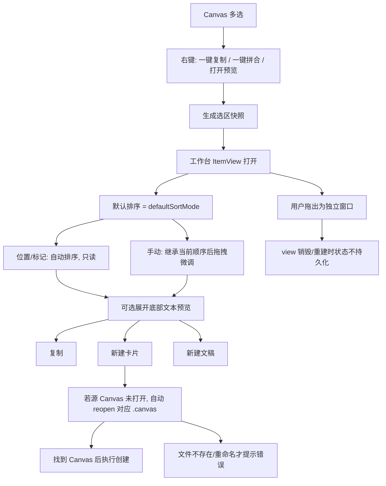

## 现有交互逻辑

当前这套“卡片拼合/复制”交互，核心问题不是功能少，而是“同一批卡片内容”被拆成了太多并列入口，用户在操作时需要同时判断 `排序方式`、`输出目标`、`是否先预览`、`是否手动调整`，认知负担偏高。

**当前交互全景**
按用户视角，当前入口分两层：

1. 单卡右键菜单
2. 多选右键菜单

单卡菜单目前比较清晰，主要是：

* `复制卡片内容`
* `拆分卡片...`
* `添加/编辑标记`
* `管理卡片属性`

真正容易混乱的是多选菜单。现在多选后，用户会看到两组能力混在一起：

* 复制类
* `按位置复制内容`
* `按标记顺序复制内容`
* `手动排序复制`
* 拼合类
* `合并 → 新建卡片`
* `合并 → 侧边栏预览`
* `合并 → 新建文稿`
* `手动排序拼合...`

这里实际包含了四个决策维度：

* 处理目标：复制 / 拼合
* 排序方式：位置 / 标记 / 手动
* 输出目标：剪贴板 / 新卡片 / 侧边栏 / 文稿
* 是否一步完成：直接执行 / 先进入拖拽排序

**现在的真实逻辑**
从实现上看，拼合和复制其实已经共享了同一套“内容生成”思路，只是暴露给用户的方式不统一：

* 自动复制：

  * 选区
  * 选排序方式
  * 直接输出到剪贴板
* 自动拼合：

  * 选区
  * 排序方式不在菜单里显式选
  * 而是由设置里的 `卡片合并默认顺序` 决定
  * 再选输出目标：

    * 新建卡片
    * 侧边栏预览
    * 新建文稿
* 手动排序复制：

  * 选区
  * 进入拖拽排序弹窗
  * 调整顺序
  * 点击 `复制`
* 手动排序拼合：

  * 选区
  * 进入同一个拖拽排序弹窗
  * 调整顺序
  * 再选输出目标：

    * `新建卡片`
    * `侧边栏预览`
    * `新建文稿`

**为什么会显得混乱**
主要有五个点。

1. 排序方式有时在菜单里选，有时在设置里选
复制是显式入口：`按位置` / `按标记` / `手动`。
拼合却不是，自动拼合的排序藏在设置里，只有手动拼合才在操作中显式出现。
2. “排序”和“输出”两个维度没有被稳定分层
复制入口是“排序优先”，拼合入口是“输出优先”。
这会让用户很难形成固定心智模型。
3. 手动排序被做成了一个独立功能，而不是一种通用步骤
用户会感觉“手动排序复制”和“手动排序拼合”像两个不同功能，但本质上只是“先调顺序，再决定输出”。
4. 侧边栏预览只存在于拼合链路
这会让“预览”看起来像一种输出目标，而不是一个中间确认步骤。
5. 设置项和即时操作的边界不清
`mergeDefaultOrder` 这种设置适合高频偏好，但当菜单里已经出现多种显式操作时，它反而容易让用户忘记当前拼合到底会按什么顺序执行。

**如果把当前逻辑抽象成一条统一流程**
其实可以归纳成：

1. 选择卡片
2. 确定顺序

   * 按位置
   * 按标记
   * 手动拖拽
3. 生成合并后的文本
4. 选择输出方式

   * 复制到剪贴板
   * 新建 Canvas 卡片
   * 侧边栏预览
   * 新建 Markdown 文稿

这条链路本身是通的，但当前 UI 没有按这条链路组织，而是把若干“结果型命令”直接平铺在菜单里。

## 优化的基本思路

位置是最符合白板的操作直觉。
预览确实是另一个维度，那么有没有可能把手动排序放到侧边栏的预览中呢？
右键菜单中只放“一键复制”和“一键拼合”，用户可以在设置中选择一键的逻辑是“按位置”或“按标记顺序”
预览再作为一个统一入口，可以拼合、可以复制、可以新建。

右键菜单：一键复制 + 一键拼合 + 预览
预览工作台的默认排序跟随"一键排序方式"设置
"一键拼合"的输出固定为新建卡片（新建文稿是低频操作，让它走预览工作台就够了）
现在命令面板里还有若干旧的合并命令（MergeToCanvasCardCommand 等），保留在命令面板，不在右键菜单露出——给绑快捷键的重度用户留后路

预览面板做成"默认在侧边栏打开，用户可以手动拖出为独立窗口"。在任何 leaf（包括侧边栏 view）的 tab 上右键 → Move to new window，或者直接拖拽 tab 出主窗口 → 自动变独立窗口。这是 Obsidian 1.x 的原生能力，不需要插件参与。所以：

```
工作台作为一个标准 ItemView 实现（继承 Obsidian 的 ItemView），注册到 workspace。这样它天然支持：

在侧边栏打开
被用户拖出成独立窗口
在主编辑区作为 tab 打开
关闭、恢复、pin 等
只要用标准 API，什么都不用特殊处理。

---

工作台作为 ItemView 时，它的状态管理要注意：用户可能把它拖到独立窗口后关掉主窗口又打开——view 会被销毁重建。所以工作台里的"当前选区快照、当前排序模式、手动拖拽结果"这些状态，要么：

A. 存在 view 实例内，关掉就丢（简单，推荐，因为工作台是一次性任务流）
B. 存到 plugin data 里持久化（过度设计，不推荐）
走 A。用户关了就是放弃这次操作，重新选卡片打开即可。符合直觉。
```

关键设计细节：

```

拖拽只在"手动"模式下生效
顶部选"位置"或"标记"时，卡片按该规则自动排列，用户看到顺序但不能拖。切到"手动"时拖拽才激活——而且此时可以以当前顺序（位置或标记）为起点继续调整，这比现在"一进手动就要从头拖"好用得多。

实时预览合并结果
工作台底部可以加个折叠面板，或者切换按钮：显示合并文本。展开后看到最终拼合的 Markdown。这是侧边栏预览原本就该做的事，现在有了一个统一的家。

输出按钮的语义
复制：合并文本到剪贴板
新建卡片：在当前 Canvas 新建一张卡片
新建文稿：新建 Markdown 文件
三个按钮并列，不分主次。或者用一个 primary 按钮 + dropdown，默认用户设置里的 一键拼合输出。

预览窗口的生命周期
多选卡片 → 菜单 → 打开预览 → 工作台占用侧边栏
工作台里的选区是快照，用户在白板上改动选区不会影响工作台（避免误操作）
想换一批卡片就重新从白板发起
```

所有关键决策：

|维度|决策|
|-|-|
|右键多选菜单|`一键复制` + `一键拼合` + `打开预览...`|
|一键拼合输出|固定新建卡片|
|预览工作台默认排序|跟随 `一键排序方式` 设置|
|工作台实现|标准 `ItemView`，默认侧边栏，用户可自行拖出|
|旧命令|保留在命令面板，从右键菜单移除|
|新增设置项|`一键排序方式`（位置 / 标记）|
|删除设置项|`mergeDefaultOutput`（已删）|
|保留设置项|`mergeDefaultOrder` →（建议改名为 `一键排序方式` 或 `defaultSortMode`，语义更清晰）|

## 初步方案

我建议把它定成两条主线：

* `一键复制` / `一键拼合` 是快速通道
* `打开预览...` 是完整工作台

这样用户心智会很稳定：默认按白板直觉走 `位置`，需要细调时才进预览。

**推荐后的交互逻辑**
右键多选菜单保留 3 个入口：

* `一键复制`
* `一键拼合`
* `打开预览...`

对应行为：

* `一键复制`

  * 直接输出到剪贴板
  * 排序方式跟随设置里的 `一键排序方式`
* `一键拼合`

  * 固定输出为“新建卡片”
  * 排序方式同样跟随 `一键排序方式`
* `打开预览...`

  * 打开标准 `ItemView`
  * 默认在右侧边栏
  * 用户可自行拖成独立窗口
  * 里面统一处理：

    * 排序切换：`位置` / `标记` / `手动`
    * 实时查看最终拼合文本
    * 输出按钮：`复制` / `新建卡片` / `新建文稿`

这比现在好的一点是：右键菜单不再同时承载“排序方式”和“输出目标”两个维度，只保留“快速动作”和“进入工作台”两个层级。

**工作台内部建议**
工作台内部我建议这样排：

1. 顶部工具栏
2. 中部卡片顺序列表
3. 底部结果预览 + 输出按钮

具体行为：

* 默认排序模式取自 `一键排序方式`
* `位置` / `标记` 模式下只展示顺序，不允许拖拽
* 切到 `手动` 时才允许拖拽
* 切到 `手动` 时，当前列表顺序应继承切换前的结果

  * 如果之前是 `位置`，就从位置排序结果开始拖
  * 如果之前是 `标记`，就从标记排序结果开始拖
* 底部实时显示最终文本结果
* 输出按钮统一作用于“当前工作台顺序”

这样“手动”就从独立功能变成“在当前排序基础上微调”，这点很关键。

**我认同的几个关键决策**
这几条我建议直接定下来：

* `mergeDefaultOrder` 改名为 `defaultSortMode` 或中文文案 `一键排序方式`
* 右键菜单不再露出旧的 `合并 → xxx` 系列
* 旧命令继续保留在命令面板，给快捷键用户使用
* 工作台状态只保存在 view 实例里，关闭即丢弃
* `新建文稿` 只放进工作台，不走右键快捷菜单

**有一个需要提前处理的技术点**
你的“选区快照”设计是对的，但要注意一个细节：

工作台里如果还能执行 `新建卡片`，它需要知道“把卡片新建到哪个 Canvas”。

所以工作台不能只存纯文本顺序，还要存最小来源上下文，例如：

* 来源 canvas 文件路径
* 选中卡片的快照数据
* 用于创建新卡的锚点信息

否则用户把工作台拖成独立窗口后，原 Canvas 不在当前活动 leaf 里，`新建卡片` 可能找不到目标画布。最稳的做法是：

* 打开工作台时记录 `canvas file path`
* 点击 `新建卡片` 时尝试解析当前 workspace 中对应的 canvas view
* 找不到就提示：`请重新打开原 Canvas 后再执行新建卡片`

这不是设计问题，但实现时必须先想清楚。

**一句话总结**
你的方案可以收敛成：

* 菜单负责“快”
* 工作台负责“全”
* 排序是统一维度
* 输出是统一维度
* 手动排序只是工作台里的一个模式，不再是独立能力

如果你愿意，我下一步可以直接把这套方案整理成一份“最终交互规格”，包括：

* 菜单结构
* 工作台布局
* 状态流转
* 与现有代码的映射改造清单

## 审核意见

审核完了。**可以采纳，但有 3 处需要你注意**。

\---

### ✅ 完全认同的部分

* 两条主线划分（"快速通道" vs "完整工作台"）——准确
* 工作台三段式布局（顶部工具栏 / 中部列表 / 底部预览+输出）——与我的建议一致
* "手动模式继承切换前顺序"——这条很重要，它是把"手动排序"从独立功能降格为"通用微调"的关键，不能丢
* 设置项改名 `defaultSortMode`——清晰

\---

### ⚠️ 需要你注意的 3 点

#### 1\. 技术提醒非常关键，但结论可以更稳

"工作台拖出独立窗口后找不到源 Canvas" 是**真问题**，但它给的兜底方案——`找不到就提示"请重新打开原 Canvas"`——体验不够好。

更稳的做法：

* 打开工作台时记录 `canvas file path`
* 执行 `新建卡片` 时，如果原 Canvas 不在当前 workspace 里，**自动用 `workspace.openLinkText` 或 `getLeaf` 打开它**，再执行新建
* 只有在文件被删除/重命名才提示错误

这样用户感知不到"原 Canvas 必须活着"这个隐藏约束。

#### 2\. "实时显示最终文本结果"要留个逃生口

底部实时预览在卡片数量多（比如 30+）或内容长时会有性能问题——每次拖拽都重新拼接全文 + 重渲染。建议：

* 默认**折叠**底部预览，用户点击展开才渲染
* 或者加防抖（200ms）
* 卡片数量超过阈值时自动折叠并提示

#### 3\. "新建文稿" 确实是低频操作"

但考虑给它加个命令面板命令 + 允许绑快捷键（右键菜单仍然不放）

\---

### 总体评价

方案可以进入落地阶段。"整理成最终交互规格 + 代码映射改造清单"是合理的下一步——**建议做，但要求包含以下内容**：

1. 菜单结构（含文案）
2. 工作台布局（含组件划分）
3. 状态流转图（尤其是"拖出独立窗口 / 源 Canvas 关闭"等边界情况）
4. **与现有代码的映射改造清单**（哪些文件删、哪些改、哪些新增）
5. **分阶段提交计划**（不要一次性大爆炸，参考我们之前讨论的 5 步迁移路径）

## 新方案

**交互规格**
多选右键菜单收敛为 3 个入口：
- `一键复制`
- `一键拼合`
- `打开预览...`

对应行为：
- `一键复制`
  - 读取当前选区快照
  - 排序方式取设置 `defaultSortMode`
  - 直接复制到剪贴板
- `一键拼合`
  - 读取当前选区快照
  - 排序方式取设置 `defaultSortMode`
  - 固定输出为“当前 Canvas 新建卡片”
- `打开预览...`
  - 读取当前选区快照
  - 打开标准 `ItemView` 工作台，默认放右侧边栏
  - 用户可原生拖出为独立窗口
  - 工作台内统一处理排序、预览、复制、新建卡片、新建文稿

设置项收敛为：
- 保留 `sortPriority`
- `mergeDefaultOrder` 改名为 `defaultSortMode`
- 设置页文案改为 `一键排序方式`
- 取值仍是 `position | badge`

旧命令策略：
- `MergeToCanvasCardCommand`
- `MergeToSidebarPreviewCommand`
- `MergeToMarkdownCommand`
- 继续保留在命令面板
- 从右键菜单移除
- `新建文稿` 不进右键菜单，但保留命令面板入口和快捷键绑定能力

**工作台布局**
工作台是标准 `ItemView`，建议替换当前极简预览 view。

顶部工具栏：
- 排序模式切换：`位置` / `标记` / `手动`
- 当前来源提示：Canvas 名称、卡片数量
- `刷新当前快照` 不提供自动联动，若要换卡片，重新从 Canvas 发起

中部列表：
- 展示当前顺序的卡片列表
- `位置` / `标记` 模式下只读，不可拖拽
- `手动` 模式下可拖拽
- 切到 `手动` 时，以切换前当前顺序为起点继续调整，不重置

底部结果区：
- 默认折叠
- 展开后显示最终合并文本
- 渲染加 200ms 防抖
- 卡片数超过阈值时默认保持折叠并提示“内容较多，展开后再渲染”
- 输出按钮统一基于当前顺序：
  - `复制`
  - `新建卡片`
  - `新建文稿`

**状态流转**


边界规则：
- 工作台保存的是“选区快照”，不是 live selection
- 用户改了白板当前选区，不影响已打开工作台
- 用户关闭工作台，视为放弃本次任务流
- 工作台被拖到独立窗口后，状态仍只活在该 view 实例内
- 执行 `新建卡片` 时，如果原 Canvas 不在 workspace，先按 `canvas file path` 自动重开，再写入
- 只有 `.canvas` 文件不存在或无法定位时才报错

**代码映射**
建议优先改这些文件。

修改：
- [src/main.ts](/D:/Code/Canvas%20Card%20Actions/src/main.ts)
  - 多选右键菜单改为只挂 3 个入口
  - 旧 merge 命令继续注册，但不加到 menu
  - 新增 `OpenPreviewWorkbenchCommand`、`QuickCopyCommand`、`QuickMergeCommand`
- [src/settings/ICanvasCardActionsSettings.ts](/D:/Code/Canvas%20Card%20Actions/src/settings/ICanvasCardActionsSettings.ts)
  - `mergeDefaultOrder` 改名 `defaultSortMode`
- [src/settings/CanvasCardActionsSettingTab.ts](/D:/Code/Canvas%20Card%20Actions/src/settings/CanvasCardActionsSettingTab.ts)
  - 设置文案同步改名
- [src/services/ContentService.ts](/D:/Code/Canvas%20Card%20Actions/src/services/ContentService.ts)
  - 保留位置/标记/手动三种排序构建能力
  - 补一个更明确的“根据排序模式返回有序卡片列表”接口，供工作台复用
- [src/services/MergeService.ts](/D:/Code/Canvas%20Card%20Actions/src/services/MergeService.ts)
  - 补“按 canvas file path 重新定位或打开源 Canvas”的能力
  - 把“创建卡片”从依赖当前激活 leaf 改为依赖源 Canvas 定位
- [src/presentation/views/MergePreviewView.ts](/D:/Code/Canvas%20Card%20Actions/src/presentation/views/MergePreviewView.ts)
  - 建议直接升级为完整工作台，或改名后保留兼容壳
- [src/presentation/views/index.ts](/D:/Code/Canvas%20Card%20Actions/src/presentation/views/index.ts)
  - 导出新工作台 view
- [src/presentation/commands/MergeCommands.ts](/D:/Code/Canvas%20Card%20Actions/src/presentation/commands/MergeCommands.ts)
  - 保留旧命令
  - 新增“打开工作台”命令
  - `ManualMergeCommand` 从右键主流程移除

新增：
- `src/presentation/views/MergeWorkbenchView.ts`
  - 工作台主视图
- `src/presentation/commands/QuickActionCommands.ts`
  - `QuickCopyCommand`
  - `QuickMergeCommand`
  - `OpenPreviewWorkbenchCommand`
- `src/services/PreviewWorkbenchService.ts`
  - 维护一次性工作台状态
  - 负责排序切换、手动顺序、惰性预览文本生成
- `src/types/WorkbenchState.ts`
  - `canvasFilePath`
  - `selectionSnapshot`
  - `sortMode`
  - `manualOrderIds`
  - `previewExpanded`

可删除或降级：
- 右键菜单里的 `copy-by-position`、`copy-by-badge`、`copy-by-manual-order`
- 右键菜单里的 `merge-to-card`、`merge-to-sidebar`、`merge-to-markdown`、`manual-merge`
- 当前 `DragSortModal` 不再是主交互，可保留给旧命令兼容，后续再决定是否删除

**5 步迁移计划**
1. 收口入口，不动底层能力  
   先把右键菜单改成 `一键复制` / `一键拼合` / `打开预览...`，旧命令只留命令面板。
2. 建工作台骨架  
   把当前 [MergePreviewView.ts](/D:/Code/Canvas%20Card%20Actions/src/presentation/views/MergePreviewView.ts) 升级为标准工作台壳，先支持：
   - 展示选区快照
   - 显示默认排序结果
   - 输出 `复制` / `新建卡片` / `新建文稿`
3. 接排序切换  
   接入 `位置` / `标记` / `手动` 三模式，保证“手动继承当前顺序”。
4. 补边界能力  
   做源 Canvas 自动 reopen、底部预览惰性渲染、防抖和大内容折叠策略。
5. 清理遗留结构  
   视验证结果决定是否淘汰 `DragSortModal` 主路径，并同步文档、命名和设置迁移。

## 开发任务清单

**开发任务单**

**阶段 1：收口右键菜单**
- 目标：多选右键菜单只保留 `一键复制`、`一键拼合`、`打开预览...`
- 修改 [src/main.ts](/D:/Code/Canvas%20Card%20Actions/src/main.ts)
- 新增快速命令类，建议放到 `src/presentation/commands/QuickActionCommands.ts`
- `一键复制`：读取 `defaultSortMode`，输出到剪贴板
- `一键拼合`：读取 `defaultSortMode`，固定输出为新建卡片
- 旧命令 `MergeToCanvasCardCommand`、`MergeToSidebarPreviewCommand`、`MergeToMarkdownCommand` 保留注册，但不再挂到右键菜单
- 旧复制命令 `按位置复制/按标记复制/手动排序复制` 也从右键菜单移除，命令面板是否保留可后续决定
- 验收标准：多选菜单只出现 3 个入口，原有快捷命令仍可从命令面板执行

**阶段 2：重命名设置项**
- 目标：把 `mergeDefaultOrder` 迁移为语义更清晰的 `defaultSortMode`
- 修改 [src/settings/ICanvasCardActionsSettings.ts](/D:/Code/Canvas%20Card%20Actions/src/settings/ICanvasCardActionsSettings.ts)
- 修改 [src/settings/CanvasCardActionsSettingTab.ts](/D:/Code/Canvas%20Card%20Actions/src/settings/CanvasCardActionsSettingTab.ts)
- `设置文案` 改为 `一键排序方式`
- 保持取值不变：`position | badge`
- 增加兼容迁移：读取旧数据时自动映射到新字段，避免用户设置丢失
- 验收标准：升级后旧用户不需要重配，设置页文案和行为一致

**阶段 3：落地预览工作台骨架**
- 目标：把当前预览 view 升级为完整工作台
- 新增 [src/presentation/views/MergeWorkbenchView.ts](/D:/Code/Canvas%20Card%20Actions/src/presentation/views/MergeWorkbenchView.ts)
- 修改 [src/presentation/views/index.ts](/D:/Code/Canvas%20Card%20Actions/src/presentation/views/index.ts)
- 在工作台中实现三段式布局：
- 顶部：排序模式切换、来源 Canvas、卡片数量
- 中部：卡片顺序列表
- 底部：合并文本预览区 + 输出按钮
- 默认在侧边栏打开，沿用标准 `ItemView` 注册方式
- 工作台状态采用一次性 view 内状态，不持久化
- 打开工作台时写入“选区快照”，后续不跟随白板 live selection
- 验收标准：从右键菜单打开工作台后，可以看到这次选区的快照和默认排序结果

**阶段 4：抽出工作台状态与排序服务**
- 目标：让工作台不直接拼 UI 逻辑，排序和输出有独立状态层
- 新增 `src/services/PreviewWorkbenchService.ts`
- 可新增 `src/types/WorkbenchState.ts`
- 状态建议包含：
- `canvasFilePath`
- `canvasFileBasename`
- `selectionSnapshot`
- `sortMode`
- `manualOrderIds`
- `previewExpanded`
- `lastComputedContent`
- 修改 [src/services/ContentService.ts](/D:/Code/Canvas%20Card%20Actions/src/services/ContentService.ts)
- 新增“返回有序卡片列表”的接口，不只返回拼好的字符串
- 让工作台能分别拿到：
- `position` 排序结果
- `badge` 排序结果
- `manual` 当前顺序结果
- 验收标准：工作台切换排序模式时，不依赖当前 Canvas 选区，完全基于快照重算

**阶段 5：实现三种排序模式**
- 目标：工作台内完成 `位置 / 标记 / 手动` 三模式统一交互
- `位置` 模式：按位置排序，列表只读
- `标记` 模式：按标记排序，列表只读
- `手动` 模式：列表可拖拽
- 切到 `手动` 时，继承当前显示顺序作为起点
- 手动顺序只记录 `id` 顺序，不重复存全文
- 现有 [src/presentation/modals/DragSortModal.ts](/D:/Code/Canvas%20Card%20Actions/src/presentation/modals/DragSortModal.ts) 的拖拽实现可以拆出复用逻辑，或先直接在工作台重写
- 验收标准：从 `位置` 或 `标记` 切到 `手动` 时，列表顺序保持当前结果；拖拽后输出结果同步变化

**阶段 6：实现底部文本预览的性能策略**
- 目标：解决长内容和大量卡片下的实时渲染负担
- 底部预览默认折叠
- 展开后才开始渲染合并结果
- 文本重算和渲染加 `200ms` 防抖
- 设阈值，例如 `>= 30` 张卡片时默认保持折叠并显示提示
- 若用户未展开预览，不主动做全文字符串拼接
- 验收标准：大量卡片拖拽排序时，工作台不会明显卡顿；展开预览后内容正确

**阶段 7：实现统一输出动作**
- 目标：工作台内统一支持 `复制 / 新建卡片 / 新建文稿`
- 修改 [src/services/MergeService.ts](/D:/Code/Canvas%20Card%20Actions/src/services/MergeService.ts)
- 输出动作全部基于“当前工作台顺序”生成的内容
- `复制`：写剪贴板
- `新建卡片`：在来源 Canvas 中创建
- `新建文稿`：继续复用 [src/adapters/VaultAdapter.ts](/D:/Code/Canvas%20Card%20Actions/src/adapters/VaultAdapter.ts)
- 低频 `新建文稿` 只放工作台和命令面板，不回到右键菜单
- 验收标准：三种输出动作内容一致，只是落点不同

**阶段 8：处理源 Canvas 自动恢复**
- 目标：工作台拖到独立窗口后，仍能稳定执行“新建卡片”
- 打开工作台时记录 `canvasFilePath`
- `新建卡片` 时先尝试定位当前 workspace 内已打开的对应 Canvas
- 如果没打开，自动用 `workspace.openLinkText` 或等效方式打开该 `.canvas`
- 打开后重新拿到 canvas 实例，再执行 add node
- 只有文件被删除、路径失效、重命名无法解析时才报错
- 需要为 `CanvasAdapter` 或新 service 增加“通过 file path 获取 canvas view”的能力
- 验收标准：即使工作台在独立窗口、原 Canvas 未活跃，也能自动打开源 Canvas 并成功新建卡片

**阶段 9：命令面板整理**
- 目标：保留重度用户能力，但不污染右键菜单
- 保留旧 merge 命令注册
- 增加工作台相关命令：
- `打开预览工作台`
- 可选：`将当前选区一键复制`
- 可选：`将当前选区一键拼合`
- 保留 `新建文稿` 命令面板入口，允许用户绑快捷键
- 验收标准：右键菜单简化，命令面板仍覆盖高级路径

**阶段 10：清理与回归**
- 目标：确保新旧逻辑共存阶段不回归
- 检查 [src/presentation/commands/index.ts](/D:/Code/Canvas%20Card%20Actions/src/presentation/commands/index.ts) 和 [src/services/index.ts](/D:/Code/Canvas%20Card%20Actions/src/services/index.ts) 导出是否完整
- 审查旧 `MergePreviewView` 是否完全替换，还是保留兼容壳
- 评估 `DragSortModal` 是否继续保留
- 执行构建验证 `npm run build`
- 手测场景：
- 多选后执行 `一键复制`
- 多选后执行 `一键拼合`
- 打开工作台后切换 `位置/标记/手动`
- 手动排序后执行 `复制/新建卡片/新建文稿`
- 工作台拖出独立窗口后再执行 `新建卡片`
- 原 Canvas 未打开时自动恢复
- 大量卡片时预览默认折叠与性能表现
- 验收标准：新主流程可用，旧命令不报错，构建通过

**建议提交切分**
- 提交 1：右键菜单收口 + 设置项改名
- 提交 2：工作台骨架 + 命令入口
- 提交 3：排序模式切换 + 手动继承
- 提交 4：统一输出 + 自动恢复源 Canvas
- 提交 5：性能优化 + 清理旧交互

**实现优先级**
- P0：阶段 1、2、3、4、5、7
- P1：阶段 8
- P1：阶段 6
- P2：阶段 9、10

如果你要，我下一步可以直接把这个任务单继续细化成“逐文件改造 checklist”。  
另外，这轮还没改代码；等开始实现后，是否要我同步更新 `docs` 目录下的交互/技术文档？
